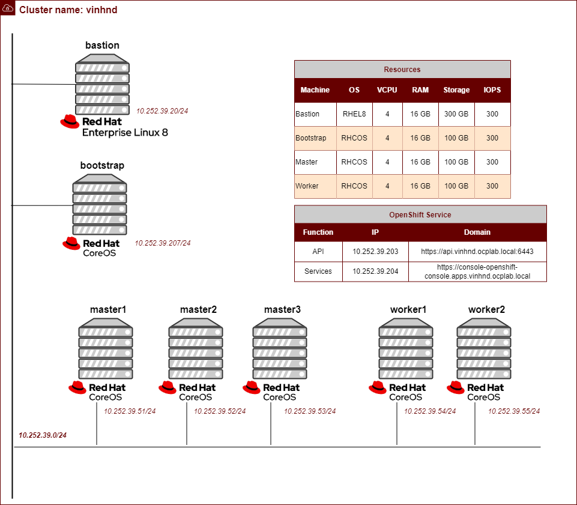
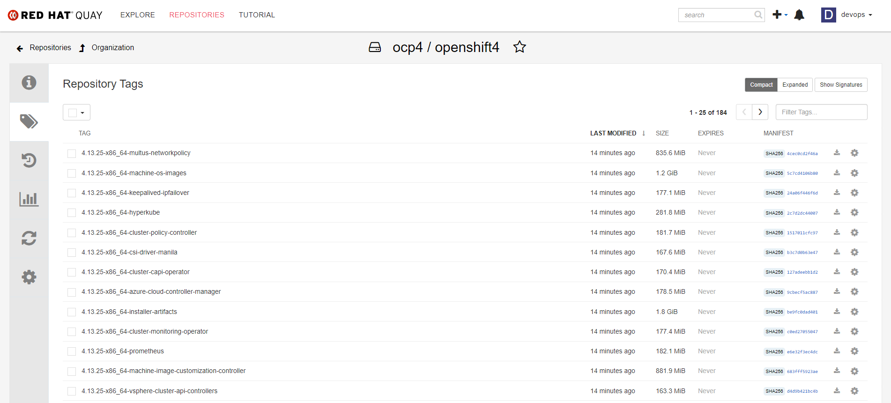
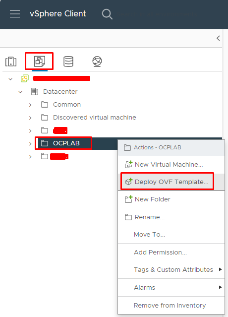
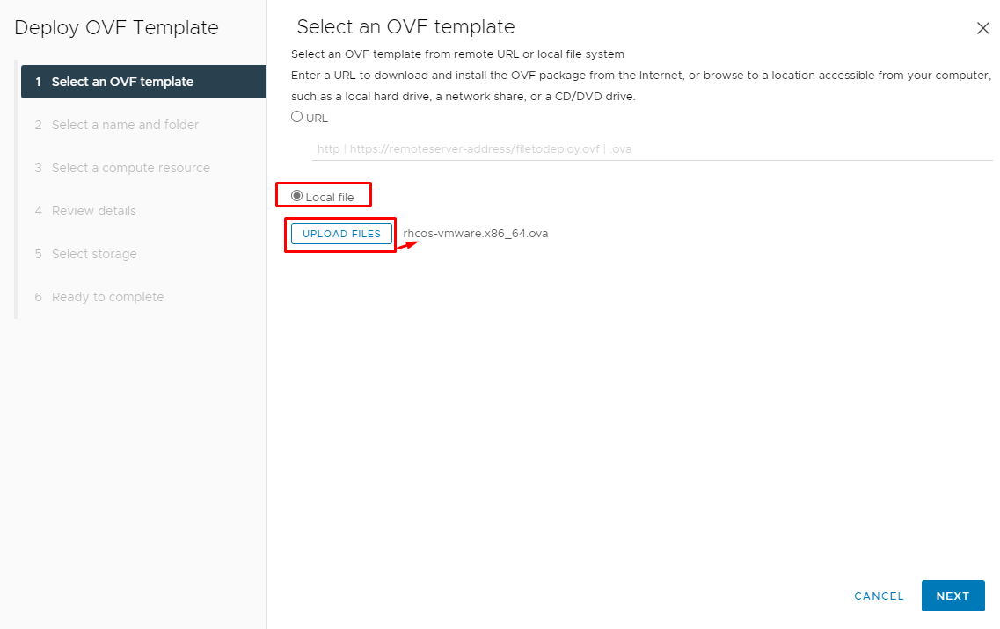
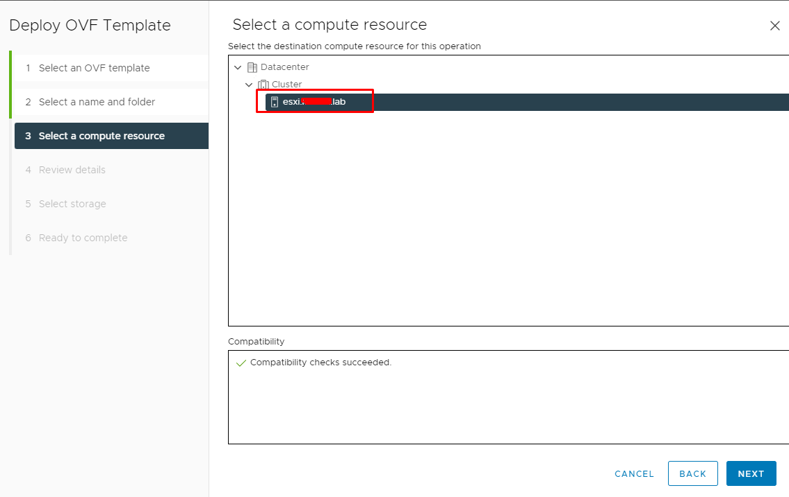
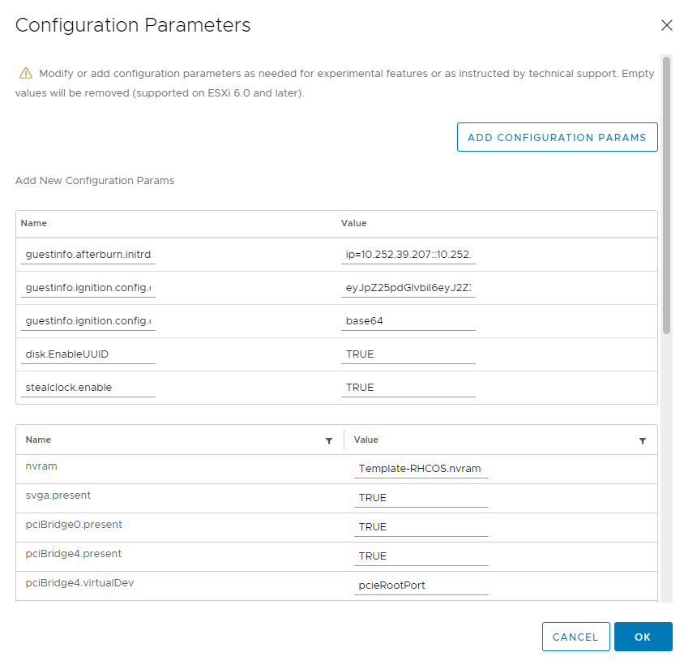

# Install OpenShift Cluster UPI on vSphere

## Planning

*Version OpenShift: 4.13.25*


## Components


**You can seperate DNS Server, Quay Registry, HTTP Server,... to another VM, in this installation guide I do not have enough resource so I will put this component on Bastion Node**
## Installation Guide


## 1. Download and Install OpenShift tools
- Login to Red Hat Portal using following URL:
```link
https://cloud.redhat.com/openshift
```
- Choose `Cluster` column, then click to `Create Cluster` bar
- Choose `Data Center` -> `vSphere`
- Choose `Full Control`
- Download Pull Secret
    
- Download Command line interface
    
- Copy to Bastion Node

***Access to Bastion Node***

- Create Installation folder and copy 
```sh
$ mkdir ~/openshift-install
$ mv openshift-client-linux.tar.gz ~/openshift-install/
$ mv pull-secret.txt ~/openshift-install/
$ cd ~/openshift-install
```
- Extract openshift client tar file
```sh
$ tar xvf openshift-client-linux.tar.gz
$ mv oc kubectl /usr/local/bin
```
## 2. Install DNS Server
In OpenShift Container Platform deployments, DNS resolution is required for the following components:
- The Kubernetes API
- The OpenShift Container Platform Application wildcard
- The Bootstrap, Master, Worker machines

***Access to Bastion Node***

- Install DNS server
```sh
$ sudo yum install bind bind-utils -y
```
- Enable and start DNS service
```sh
$ sudo systemctl enable –-now named
```
- Configuration DNS server
```sh
cat << EOF > /etc/named.conf < EOF >>
//
// named.conf
//
// Provided by Red Hat bind package to configure the ISC BIND named(8) DNS
// server as a caching only nameserver (as a localhost DNS resolver only).
//
// See /usr/share/doc/bind*/sample/ for example named configuration files.
//

options {
        listen-on port 53 { 127.0.0.1; 10.252.39.20; };
        listen-on-v6 port 53 { ::1; };
        directory       "/var/named";
        dump-file       "/var/named/data/cache_dump.db";
        statistics-file "/var/named/data/named_stats.txt";
        memstatistics-file "/var/named/data/named_mem_stats.txt";
        secroots-file   "/var/named/data/named.secroots";
        recursing-file  "/var/named/data/named.recursing";
        allow-query     { localhost; 10.252.39.0/24; };

        /*
         - If you are building an AUTHORITATIVE DNS server, do NOT enable recursion.
         - If you are building a RECURSIVE (caching) DNS server, you need to enable
           recursion.
         - If your recursive DNS server has a public IP address, you MUST enable access
           control to limit queries to your legitimate users. Failing to do so will
           cause your server to become part of large scale DNS amplification
           attacks. Implementing BCP38 within your network would greatly
           reduce such attack surface
        */
        recursion yes;

        dnssec-enable yes;
        dnssec-validation yes;

        managed-keys-directory "/var/named/dynamic";

        pid-file "/run/named/named.pid";
        session-keyfile "/run/named/session.key";

        /* https://fedoraproject.org/wiki/Changes/CryptoPolicy */
        include "/etc/crypto-policies/back-ends/bind.config";
};

logging {
        channel default_debug {
                file "data/named.run";
                severity dynamic;
        };
};

zone "." IN {
        type hint;
        file "named.ca";
};

//forward zone
zone "ocplab.local" {
  type master;
  file "/var/named/ocplab.local.db";
  allow-query { any; };
};

//forward zone
zone "vinhnd.lab" {
  type master;
  file "/var/named/vinhnd.lab.db";
  allow-query { any; };
};

//backward zone
zone "39.252.10.in-addr.arpa" IN {
  type master;
  file "/var/named/39.252.10.rev";
  allow-query { any; };
};


include "/etc/named.rfc1912.zones";
include "/etc/named.root.key";
EOF
```
- Create DNS record
```sh
cat << EOF > /var/named/ocplab.local.db
$TTL 86400
@ IN SOA bastion.ocplab.local. quay.ocplab.local. (
                                                2020011800 ;Serial
                                                3600 ;Refresh
                                                1800 ;Retry
                                                604800 ;Expire
                                                86400 ;Minimum TTL
)

;Name Server Information
@ IN NS bastion.ocplab.local.

;IP Address for Name Server
bastion IN A 10.252.39.20
quay    IN A 10.252.39.20

;Mail Server MX (Mail exchanger) Record

;A Record for the following Host name

api.vinhnd IN A 10.252.39.203
api-int.vinhnd IN A 10.252.39.203
*.apps.vinhnd IN A 10.252.39.204
bootstrap IN A 10.252.39.207

master1 IN A 10.252.39.51
master2 IN A 10.252.39.52
master3 IN A 10.252.39.53

worker1 IN A 10.252.39.54
worker2 IN A 10.252.39.52
worker3 IN A 10.252.39.53
EOF

cat << EOF > /var/named/vinhnd.lab.db
$TTL 86400
@ IN SOA bastion.ocplab.local. quay.ocplab.local. (
                                                2020011800 ;Serial
                                                3600 ;Refresh
                                                1800 ;Retry
                                                604800 ;Expire
                                                86400 ;Minimum TTL
)

;Name Server Information
@ IN NS bastion.ocplab.local.

;IP Address for Name Server
vcenter IN A 10.252.39.15
EOF
```
- Restart DNS Service
```sh
$ systemctl restart named
```
- Validate DNS resolution
```sh
curl -v -k https://quay.ocplab.local
```
```sh
[root@lab-quay openshift-install]# curl -v -k https://quay.ocplab.local
* Rebuilt URL to: https://quay.ocplab.local/
*   Trying 10.252.39.20...
* TCP_NODELAY set
* Connected to quay.ocplab.local (10.252.39.20) port 443 (#0)
```
## 3. Install Apache Web Server

***Access to Bastion Node***

- Install Apache Web Server
```sh
$ sudo yum install -y httpd
```
- Change the default apache listening port from 80 to 8080 
```sh
$ sudo sed -i s/Listen 80/Listen 0.0.0.0:8080/ /etc/httpd/conf/httpd.conf
```
- Enable and start http service
```sh
$ sudo systemctl enable --now httpd
```
- Create folder for machines pull file
```sh
$ mkdir /var/www/html/ocp4
```
- Set the required permissions on ocp4 directory
```sh
$ chown -R apache: /var/www/html/ocp4/
$ chmod 755 /var/www/html/ocp4/
```

## 4. Copy Vcenter certification
- Download from vcenter
    
- Copy to Bastion node

***Access to Bastion Node***

- Copy to trusted cert
```sh
$ cp certs/lin/* /etc/pki/ca-trust/source/anchors
$ update-ca-trust extract
```
## 5. Mirror images to local Registry

***Access to Bastion Node***

### 5.1 Configuring credentials that allow images to be mirrors
- Access to install directory
```sh
$ cd ~/openshift-install/
```

- Generate base64-encoded for username and password or token for mirror registry
    *(This user/pass is the credential you usually login Quay registry)*
    ```sh
    echo -n 'devops:aloalo@202$' | base64 -w0
    ```
    - Then you will have this string:
    ```txt
    ZGV2b3BzOmFsb2Fsb0AyMDIk
    ```
    - Fill this string to this section:
    ```json
    "quay.ocplab.local": {
    "auth": "ZGV2b3BzOmFsb2Fsb0AyMDIk",
    "email": "vinhnd@ldcc.vn"
    }
    ```
- Edit file pull-secret.txt
```json
{"auths":{"quay.ocplab.local":{"auth": "ZGV2b3BzOmFsb2Fsb0AyMDIk","email": "vinhnd@ldcc.vn"},"cloud.openshift.com":{"auth":"<--somthing already exist-->","email":"<--somthing already exist-->"},"quay.io":{"auth":"b3BlbnNoaWZ0LXJlbGVhc2UtZGV2K29jbV9hY2Nlc3NfNzA3YzQ2YTQ2ZjVmNDFiMGJjNjhlOGNjYTIxNWEyOGI6OTVBRE9FTVVNUVZDTjlZMlVXMTU5SzgxVFZQWkxQSTZLVVJHRkFXNE1KTEM4WVVPOFFaQ0U2Vk4zTk9USUU5SQ==","email":"<--somthing already exist-->"},"registry.connect.redhat.com":{"auth":"<--somthing already exist-->","email":"<--somthing already exist-->"},"registry.redhat.io":{"auth":"<--somthing already exist-->","email":"<--somthing already exist-->"}}}
```   
- Clone pull-secret file into JSON format
```sh
$ cat ./pull-secret.txt | jq . > ./pull-secret.json
```
- Check pull-secret.json
```json
{
  "auths": {
    "quay.ocplab.local": {
      "auth": "ZGV2b3BzOmFsb2Fsb0AyMDIk",
      "email": "vinhnd@ldcc.vn"
    },
    "cloud.openshift.com": {
      "auth": "<--somthing already exist-->",
      "email": "<--somthing already exist-->"
    },
    "quay.io": {
      "auth": "<--somthing already exist-->",
      "email": "<--somthing already exist-->"
    },
    "registry.connect.redhat.com": {
      "auth": "<--somthing already exist-->",
      "email": "<--somthing already exist-->"
    },
    "registry.redhat.io": {
      "auth": "<--somthing already exist-->",
      "email": "<--somthing already exist-->"
    }
  }
}
```
### 5.2 Mirroring the OpenShift Container Platform image repository
Mirror the OpenShift Container Platform image repository to your registry to use during cluster installation or upgrade
Procedure

*Determine the version of OpenShift Container Platform that you want to install and determine the corresponding tag on the Repository Tags page.*

- Directly push the release images to the local registry by following command:
    ```sh
    $ oc adm release mirror -a /root/openshift-install/pull-secret.json --from=quay.io/openshift-release-dev/ocp-release:4.13.25-x86_64 --to=quay.ocplab.local/ocp4/openshift4 --to-release-image=quay.ocplab.local/ocp4/openshift4:4.13.25-x86_64 --insecure
    ```
    - *Kết quả:*
    ```sh
    info: Mirroring completed in 1.28s (0B/s)

    Success
    Update image:  quay.ocplab.local/ocp4/openshift4:4.13.25-x86_64
    Mirror prefix: quay.ocplab.local/ocp4/openshift4
    Mirror prefix: quay.ocplab.local/ocp4/openshift4:4.13.25-x86_64

    To use the new mirrored repository to install, add the following section to the install-config.yaml:

    imageContentSources:
    - mirrors:
    - quay.ocplab.local/ocp4/openshift4
    source: quay.io/openshift-release-dev/ocp-release
    - mirrors:
    - quay.ocplab.local/ocp4/openshift4
    source: quay.io/openshift-release-dev/ocp-v4.0-art-dev


    To use the new mirrored repository for upgrades, use the following to create an ImageContentSourcePolicy:

    apiVersion: operator.openshift.io/v1alpha1
    kind: ImageContentSourcePolicy
    metadata:
    name: example
    spec:
    repositoryDigestMirrors:
    - mirrors:
        - quay.ocplab.local/ocp4/openshift4
        source: quay.io/openshift-release-dev/ocp-release
    - mirrors:
        - quay.ocplab.local/ocp4/openshift4
        source: quay.io/openshift-release-dev/ocp-v4.0-art-dev
    ```
    
- Create `openshift-install` tools for when using mirror registry
    ```sh
    $ oc adm release extract -a /root/openshift-install/pull-secret.json --command=openshift-install "quay.ocplab.local/ocp4/openshift4:4.13.25-x86_64"
    ```
- Check the valid `openshift-install` tool
    ```sh
    $ ./openshift-install version
    ```
    - *Kết quả:*
    ```sh
    [root@lab-quay openshift-install]# ./openshift-install version
    ./openshift-install 4.13.25
    built from commit 293f6a2fd4b7e8039f8163354409683ba7a072e2
    release image quay.ocplab.local/ocp4/openshift4@sha256:480f2026c07b0f2e19c3fc60a44e4a7147ab821474641952f077573d05747855
    release architecture amd64
    ```

## 6. Manually creating the installtion configuration file

***Access to Bastion Node***

### 6.1 Generating a key pair for cluster node SSH access
- Create SSH key pair on local machine:
```sh
$ ssh-keygen -t ed25519 -N '' -f ~/.ssh/id_ocplab
```
- View the public SSH key:
```sh
$ cat ~/.ssh/id_ocplab.pub
```
- Add the SSH private key identity to the SSH agent for you local user:
```sh
$ eval "$(ssh-agent -s)"
```
- Add SSH private to the ssh-agent:
```sh
$ ssh-add ~/.ssh/id_ocplab.pub
```
### 6.2 Create the sample install-config.yaml  
- Access to install directory
```sh
$ cd ~/openshift-install/
```
- Create folder store install template
```sh
$ mkdir install-template
```
- Create the sample install-config.yaml  file template that is provided and save it in the installation directory and provide details about your cluster configuration at the prompt:
    - SSH public key generated from `#6.1`
    - Choose platform `vsphere`
    - Fill vCenter domain
    - Fill Username/Password
    - Choose vSphere Datastore
    - Choose vSphere Datacenter
    - Choose vSphere Cluster
    - Choose vSphere Network
    - Fill IP Address for OpenShift API 
    - Fill IP Address for OpenShift Ingress
    - Fill OpenShift base Domain
    - Fill OpenShift Cluster Name
    - Pull Secret is content of file `pull-secret.txt`
```sh
[root@lab-quay openshift-install]# ./openshift-install create install-config --dir ./install-template
? SSH Public Key /root/.ssh/id_ocplab.pub
? Platform vsphere
? vCenter vcenter.vinhnd.lab
? Username administrator@vsphere.local
? Password [? for help] **********
INFO Connecting to vCenter vcenter.vinhnd.lab
INFO Defaulting to only available datacenter: Datacenter
INFO Defaulting to only available cluster: /Datacenter/host/Cluster
? Default Datastore /Datacenter/datastore/DC-Umbala-SSD-Volume
? Network vSW-Olala-Sub-10-252-39-0
? Virtual IP Address for API 10.252.39.203
? Virtual IP Address for Ingress 10.252.39.204
? Base Domain ocplab.local
? Cluster Name vinhnd
? Pull Secret [? for help] ***********************************************************************************************************************************************************************
```
- Edit this file to this
```yml 
additionalTrustBundlePolicy: Proxyonly
apiVersion: v1
baseDomain: ocplab.local
proxy:
  httpProxy: http://192.168.30.6:3128
  httpsProxy: http://192.168.30.6:3128
  noProxy: 10.252.0.0/16,localhost,.vinhnd.vn,.vinhnd.lab,127.0.0.1,.ocplab.local,10.252.39.20
compute:
- architecture: amd64
  hyperthreading: Enabled
  name: worker
  platform: {}
  replicas: 0
controlPlane:
  architecture: amd64
  hyperthreading: Enabled
  name: master
  platform: {}
  replicas: 3
metadata:
  creationTimestamp: null
  name: vinhnd
networking:
  clusterNetwork:
  - cidr: 10.128.0.0/14
    hostPrefix: 23
  machineNetwork:
  - cidr: 10.252.39.0/24
  networkType: OVNKubernetes
  serviceNetwork:
  - 172.30.0.0/16
platform:
  vsphere:
    apiVIPs:
    - 10.252.39.203
    failureDomains:
    - name: generated-failure-domain
      region: generated-region
      server: vcenter.vinhnd.lab
      topology:
        computeCluster: /Datacenter/host/Cluster
        datacenter: Datacenter
        datastore: /Datacenter/datastore/DC-Umbala-SSD-Volume
        networks:
        - vSW-Olala-Sub-10-252-39-0
        resourcePool: /Datacenter/host/Cluster//Resources
      zone: generated-zone
    ingressVIPs:
    - 10.252.39.204
    vcenters:
    - datacenters:
      - Datacenter
      password: Emyeucongty!2#
      port: 443
      server: vcenter.vinhnd.lab
      user: administrator@vsphere.local
publish: External
pullSecret: '{"auths":{"quay.ocplab.local":{"auth":"ZGV2b3BzOmFsb2Fsb0AyMDIk","email":"vinhnd@ldcc.vn"}}}'
additionalTrustBundle: |
      -----BEGIN CERTIFICATE-----
      -----END CERTIFICATE-----
sshKey: |
  ssh-rsa <> root@lab-quay
imageContentSources:
- mirrors:
  - quay.ocplab.local/ocp4/openshift4
  source: quay.io/openshift-release-dev/ocp-release
- mirrors:
  - quay.ocplab.local/ocp4/openshift4
  source: quay.io/openshift-release-dev/ocp-v4.0-art-dev
```
- Backup install config file
```sh
$ cp install-template/install-config.yaml install-config.yaml.bak
```
### 6.3 Creating the Kubernetes manifests and Ignition config files
- Creating the Kubernetes manifests and Ignition config files
```sh
$ ./openshift-install create manifests --dir install-template
```
- Remove the Kubernetes manifest files that define the control plane machines and compute machine sets
```sh
$ rm -f install-template/openshift/99_openshift-cluster-api_master-machines-*.yaml install-template/openshift/99_openshift-cluster-api_worker-machineset-*.yaml
```
- Check that the mastersSchedulable parameter in the <installation_directory>/manifests/cluster-scheduler-02-config.yml Kubernetes manifest file is set to `false`. This setting prevents pods from being scheduled on the control plane machines
```sh
$ vim install-template/manifests/cluster-scheduler-02-config.yml
```
- To create the Ignition configuration files, run the following command from the directory that contains the installation program
```sh
$ ./openshift-install create ignition-configs --dir install-template
```


## 7. Install RHCOS and start the Openshift Container Platform bootstrap process
To install OpenShift Container Platform on user-provisioned infrastructure on VMware vSphere, you must install Red Hat Enterprise Linux CoreOS (RHCOS) on vSphere hosts. When you install RHCOS, you must provide the Ignition config file that was generated by the OpenShift Container Platform installation program for the type of machine you are installing. If you have configured suitable networking, DNS, and load balancing infrastructure, the OpenShift Container Platform bootstrap process begins automatically after the RHCOS machines have rebooted.
### 7.1 Create a Ignition config file for nodes

***Access to Bastion Node***

- Copy bootstrap merge ignition file to HTTPD server (step #6.3)
```sh
$ cp install-template/bootstrap.ign /var/www/html/ocp4/
```
- Create bootstrap merge Ignition config file 
```sh
$ cat << EOF > install-template/bootstrap.ign
{
  "ignition": {
    "config": {
      "merge": [
        {
          "source": "http://10.252.39.20:8080/ocp4/bootstrap.ign",
          "verification": {}
        }
      ]
    },
    "timeouts": {},
    "version": "3.2.0"
  },
  "networkd": {},
  "passwd": {},
  "storage": {},
  "systemd": {}
}
EOF
```
- Convert the Ignition config files to Base64 encoding. Later in this procedure, you must add these files to the extra configuration parameter  `guestinfo.ignition.config.data` in your VM
```sh
### bootstrap ###
$ base64 -w0 install-template/merge-bootstrap.ign install-template/merge-bootstrap.64
### master ###
$ base64 -w0 install-template/master.ign install-template/master.64
### worker ###
$ base64 -w0 install-template/worker.ign install-template/worker.64
```
### 7.2 Create OVF template

- Access to this url to Download ova for create template [RHCOS image mirror page](https://mirror.openshift.com/pub/openshift-v4/dependencies/rhcos/4.13/latest/)

- Download this file


- In the vSphere Client, create a folder in your datacenter to store your VMs.
  - Create Folder `OCPLAB`

  

  - Choose option to create OVF template

  
  - On the Select an OVF tab, specify the name of the RHCOS OVA file that you downloaded.

  

  - On the Select a name and folder tab, set a Virtual machine name for your template, such as Template-RHCOS. Click the name of your vSphere cluster and select the folder you created in the previous step.

  

  - On the Select a compute resource tab, click the name of your vSphere cluster.

  

  - On the Select storage tab, configure the storage options for your VM.

      - Select Thin Provision or Thick Provision, based on your storage preferences.

      - Select the datastore that you specified in your install-config.yaml file.

  - On the Select network tab, specify the network that you configured for the cluster, if available.

  - When creating the OVF template, do not specify values on the Customize template tab or configure the template any further.

-----
### 7.3 Boot VM
After the template deploys, deploy a VM for a machine in the cluster.
- Right-click the template name and click `Clone → Clone to Virtual Machine`.
- On the `Select a name and folder tab`, specify a name for the VM. You might include the machine type in the name, such as control-plane-0 or compute-1
- On the `Select a name and folder tab`, select the name of the folder that you created for the cluster.
- On the `Select a compute resource tab`, select the name of a host in your datacenter.

- On the `Select clone options tab`, select Customize this virtual machine’s hardware.

- On the `Customize hardware tab`, click Advanced Parameters.
  - Set your static IP configuration, set the guestinfo.afterburn.initrd.network-kargs property before you boot a VM from an OVA in vSphere:
  ```
  guestinfo.afterburn.initrd.network-kargs | ip=10.252.39.<something cool>::10.252.39.1:255.255.255.0:::none nameserver=10.252.39.20
  ``` 
  - guestinfo.ignition.config.data: Locate the base-64 encoded files that you created previously in this procedure, and paste the contents of the base64-encoded Ignition config file for this machine type.
  ```sh
  guestinfo.ignition.config.data | <base64content_generate_in_step_7.1>
  #bootstrap
  Paste content of file `merge-bootstrap.64`
  #master
  Paste content of file `master.64`
  #worker
  Paste content of file `worker.64`
  ```
  - guestinfo.ignition.config.data.encoding: Specify base64.
  ```
  guestinfo.ignition.config.data.encoding | base64
  ```
  - stealclock.enable: If this parameter was not defined, add it and specify TRUE.
  ```
  stealclock.enable | TRUE
  ```

  

- In the `Virtual Hardware` panel of the `Customize hardware` tab, modify the specified values as required. Ensure that the amount of RAM, CPU, and disk storage meets the minimum requirements for the machine type. 
- Complete the remaining configuration steps. On clicking the `Finish` button, you have completed the cloning operation.
- From the `Virtual Machines tab`, right-click on your VM and then select `Power → Power On`.
- Check the console output to verify that Ignition ran.


# Trap
***Access bootstrap node***

- After master provisioned, edit this to schedule pod on this node
```sh
oc edit node 
```
```yml
- effect: NoSchedule
  key: node.cloudprovider.kubernetes.io/uninitialized
  value: "true"
```
***Access master node***

- Do same thing with worker, edit this to schedule pod on this node
- Approve to join node
```yml
oc get csr
oc get csr -o go-template='{{range .items}}{{if not .status}}{{.metadata.name}}{{"\n"}}{{end}}{{end}}' | xargs --no-run-if-empty oc adm certificate approves
```

